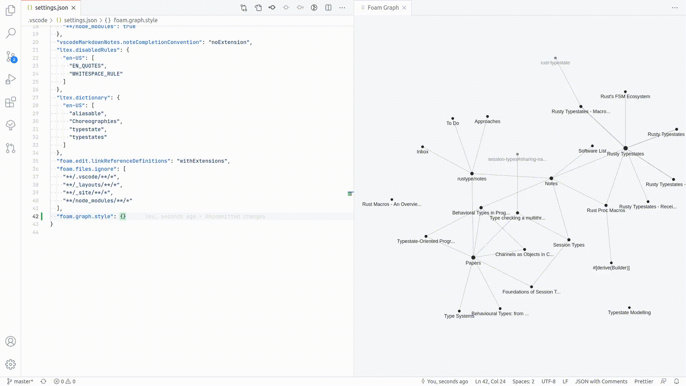

# 图谱可视化

图谱视图会将笔记转换为可视化网络，展示思想之间的关联。运行 `Foam: Show Graph` 命令即可打开。

文件和标签显示为节点；文件之间的链接以及文件与标签之间的关系显示为边。节点的连接越多，尺寸越大。

### `Show Graph` 命令

1. **Press `Ctrl+Shift+P` / `Cmd+Shift+P`**
2. **Type "Foam: Show Graph"**
3. **Press Enter**

你可以设置自定义键盘快捷键：

1. **转到 File > Preferences > Keyboard Shortcuts**
2. **搜索“Foam: Show Graph”**
3. **分配你偏好的快捷键**

## 图谱导航

使用 Foam 图谱可视化，你可以：

- 将鼠标悬停在节点上以突出显示它，快速查看它与其他笔记的连接方式
- 点击节点选择一个或多个节点（选择时按住 `shift`），更好地了解笔记结构
- 按住 `ctrl` 或 `cmd` 的同时点击节点，导航到对应笔记
- 自动将图谱居中到当前正在编辑的笔记，立即查看其连接

### 预览模式

默认情况下，点击节点会在编辑器中打开源文件。若要改为打开 Markdown 预览，请启用 `foam.graph.navigateToPreview` 设置：

```json
"foam.graph.navigateToPreview": true
```

这样会提供双面板布局：一侧显示图谱，另一侧显示渲染后的预览，中间不再显示源代码编辑器。无论此设置如何，非 Markdown 文件（附件、图片等）始终会在编辑器中打开。

## 分组

图谱右上角的 **Groups** 面板控制哪些节点可见以及节点的颜色。它分为三个部分：

**Color by**：设置节点的默认着色策略：

- `None`：每种节点类型使用自己的颜色
- `Type`：按照笔记的 `type` frontmatter 属性着色
- `Directory`：按照文件所在目录着色

**Built-in types**：为 `tag`、`attachment`、`image` 和 `placeholder` 节点提供复选框和颜色点。取消选中可隐藏节点，点击颜色点可更改颜色。

**Custom groups**：由你定义的规则，用于为部分笔记着色（也可以隐藏）。每个分组根据某个属性匹配笔记并分配颜色。点击 `+ Add group` 创建分组。

分组可以按照以下条件匹配笔记：

- `type`：精确匹配笔记类型（例如 `project`）
- `path`：匹配文件路径中的子字符串（例如 `journal`）
- `tag`：精确匹配标签（例如 `daily`）
- `title`：匹配笔记标题中的子字符串
- 任意 frontmatter 键：精确匹配自定义属性

使用 `/regex/` 语法进行模式匹配，例如 `/^2024/` 可以匹配以 `2024` 开头的路径。

分组会叠加在默认颜色之上，最后匹配的分组优先。取消选中某个分组会隐藏只属于该分组的笔记。

## 命名视图

在 `foam.graph.views` 中定义预配置的图谱视图。每次打开图谱时都会自动应用名为 **`"Default"`** 的视图，可用它设置偏好的初始配置。

```json
"foam.graph.views": [
  {
    "name": "Default",
    "colorBy": "directory",
    "show": {
      "tag": { "enabled": false },
      "placeholder": { "enabled": false }
    }
  },
  {
    "name": "Journal",
    "colorBy": "directory",
    "show": {
      "tag": { "enabled": false },
      "placeholder": { "enabled": false }
    },
    "groups": [
      {
        "id": "journal",
        "label": "path=journal",
        "color": "#6bcb77",
        "enabled": true,
        "match": { "property": "path", "value": "journal" }
      }
    ]
  }
]
```

通过 `keybindings.json` 中的键绑定打开命名视图：

```json
{
  "key": "ctrl+shift+j",
  "command": "foam-vscode.show-graph",
  "args": { "view": "Journal" }
}
```

你也可以不使用命名视图，直接以内联方式传入配置：

```json
{
  "key": "ctrl+shift+g",
  "command": "foam-vscode.show-graph",
  "args": {
    "config": {
      "colorBy": "type",
      "show": { "placeholder": { "enabled": false } }
    }
  }
}
```

**视图配置字段：**

| 字段         | 描述                                                                                   |
| ------------ | -------------------------------------------------------------------------------------- |
| `name`       | 面板标题中显示的名称。使用 `"Default"` 可在打开时自动应用。                         |
| `colorBy`    | `"none"`、`"directory"` 或 `"type"`                                                     |
| `groups`     | 自定义分组规则数组（参见上面的“分组”部分）                                              |
| `show`       | 每种内置类型的配置：`{ "tag": { "enabled": true, "color": "#ff0000" } }`              |
| `background` | 背景颜色覆盖                                                                           |
| `fontSize`   | 字体大小覆盖                                                                           |
| `fontFamily` | 字体覆盖                                                                               |
| `lineColor`  | 边颜色覆盖                                                                             |

所有字段都是可选的。如果同时提供 `view` 和 `config`，`config` 会合并到命名视图之上。

## 接下来做什么

掌握图谱视图后，你可以继续探索 Foam 的高级功能：

1. **[[wikilinks]]** - 了解双向连接
2. **[[templates]]** - 有效使用模板，规范笔记创建流程
3. **[[tags]]** - 使用标签组织笔记
4. **[[daily-notes]]** - 设置每日笔记，建立记录习惯

---

## 旧版：`foam.graph.style`

> **已弃用。**请改用 `foam.graph.views` 配置图谱（见上文）。定义一个 `"Default"` 视图，以替代 `foam.graph.style` 中的设置。

`foam.graph.style` 仍然有效，并会在任何视图配置之前作为基础层应用：

```json
"foam.graph.style": {
    "background": "#202020",
    "fontSize": 12,
    "fontFamily": "Sans-Serif",
    "lineColor": "#277da1",
    "lineWidth": 0.2,
    "particleWidth": 1.0,
    "highlightedForeground": "#f9c74f",
    "node": {
        "note": "#277da1",
        "placeholder": "#545454",
        "tag": "#f9c74f"
    }
}
```



[wikilinks]: wikilinks.md "Wikilinks"
[templates]: templates.md "笔记模板"
[tags]: tags.md "标签"
[daily-notes]: daily-notes.md "每日笔记"
