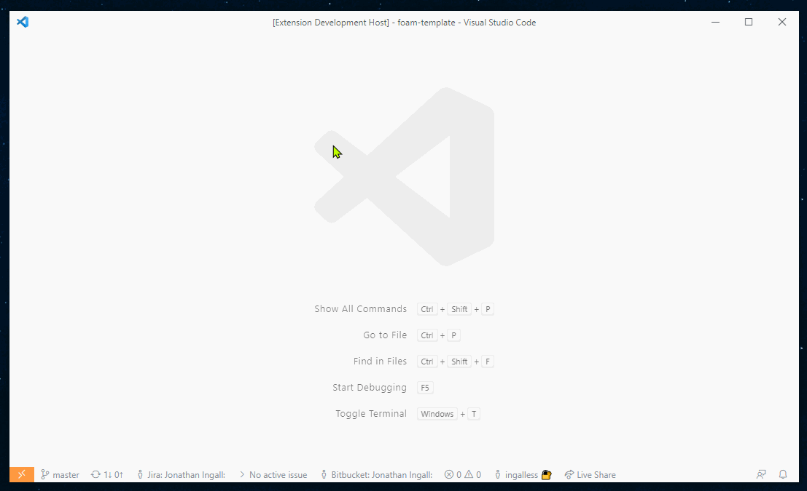
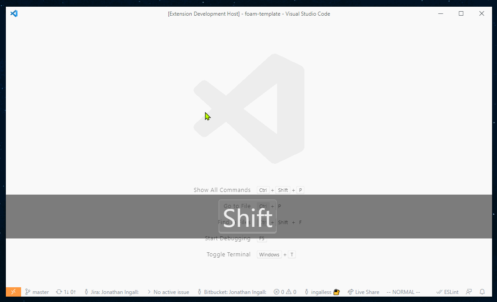
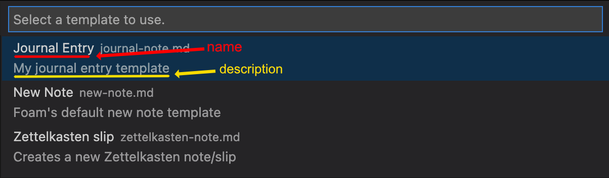

# 笔记模板

Foam 支持笔记模板，让你可以自定义笔记的初始内容，而不必每次都从空白笔记开始。

Foam 支持两种模板：

- **Markdown 模板**（`.md` 文件）- 包含预定义内容和变量的简单模板
- **JavaScript 模板**（`.js` 文件）- 可根据上下文调整并进行智能判断的模板

两种模板都位于工作区专用的 `.foam/templates` 目录中。

## 快速开始

### 创建模板

**对于简单模板：**

- 在命令面板中运行 `Foam: Create New Template` 命令
- 或者在 `.foam/templates` 目录中手动创建普通 `.md` 文件

**对于智能模板：**

- 在 `.foam/templates` 目录中创建 `.js` 文件（参见下方的 [JavaScript 模板](#javascript-templates) 部分）



### 使用模板

要根据模板创建笔记：

- 运行 `Foam: Create New Note From Template` 命令并按照提示操作。如果还没有创建模板，也不用担心！如果不存在模板，系统会提示你创建新的简单模板。
- 或者运行 `Foam: Create New Note` 命令，该命令会使用专用的默认模板（如果存在，则使用 `.foam/templates/new-note.md` 或 `.foam/templates/new-note.js`）



## 特殊模板

### 默认模板

`Foam: Create New Note` 命令会使用默认模板。Foam 会按以下顺序查找模板：

1. `.foam/templates/new-note.js` (JavaScript template)
2. `.foam/templates/new-note.md` (Markdown template)

你可以自定义此模板，使其包含每次创建笔记时都需要加入的内容。

### 默认每日笔记模板

创建每日笔记时会使用每日笔记模板（例如运行 `Foam: Open Daily Note`）。Foam 会按以下顺序查找模板：

1. `.foam/templates/daily-note.js` (JavaScript template)
2. `.foam/templates/daily-note.md` (Markdown template)

对于简单的 Markdown 模板，_建议_按照以下方式定义 YAML Front-Matter：

```markdown
---
type: daily-note
---
```

## JavaScript 模板

JavaScript 模板是创建智能、上下文感知型笔记模板的强大方式，可以根据情况进行调整。与静态 Markdown 模板不同，JavaScript 模板可以智能判断要包含哪些内容。

**在以下情况下可以使用 JavaScript 模板：**

- 根据星期、时间或日期创建不同的笔记结构
- 根据创建笔记的位置调整模板
- 自动查找并链接工作区中的相关笔记
- 根据现有笔记或工作区结构生成内容
- 实现静态模板无法处理的复杂逻辑

### JavaScript 模板基本结构

JavaScript 模板是一个 `.js` 文件，它导出一个返回笔记内容以及可选文件位置的函数：

```javascript
// .foam/templates/daily-note.js
async function createNote({ trigger, foam, resolver, foamDate }) {
  const today = dayjs();
  // 也可以使用 foamDate 创建特定日期的笔记，参见 FOAM_DATE_* 变量
  // const day = dayjs(foamDate)
  const formattedDay = today.format('YYYY-MM-DD');

  // 如果需要变量，可以使用 resolver
  // const title = await resolver.resolveFromName('FOAM_TITLE');

  console.log('正在创建今天的笔记：' + formattedDay, JSON.stringify(trigger));

  let content = `# 每日笔记 - ${formattedDay}

  ## 今天的重点
- 

  ## 笔记
- 
`;

  switch (today.day()) {
    case 1: // Monday
      content = `# 每周计划 - ${formattedDay}

    ## 本周目标
- [ ] Goal 1
- [ ] Goal 2

## 重点领域
- 
`;
      break;
    case 5: // Friday
      content = `# 每周回顾 - ${formattedDay}

    ## 做得好的地方
- 

## 可以改进的地方
- 

## 下周重点
- 
`;
      break;
  }

  return {
    content,
    filepath: `/weekly-planning/${formattedDay}.md`,
  };
}
```

### 示例

**智能会议笔记：**

```javascript
async function createNote({ trigger, foam, resolver }) {
  const title = (await resolver.resolveFromName('FOAM_TITLE')) || 'Meeting';
  const today = dayjs();
  // 根据标题检测会议类型
  const isStandup = title.toLowerCase().includes('standup');
  const isReview = title.toLowerCase().includes('review');

  let template = `# ${title} - ${today.format('YYYY-MM-DD')}

`;

  if (isStandup) {
    template += `## 我昨天做了什么
- 

## 我今天要做什么
- 

## 阻碍
- 
`;
  } else if (isReview) {
    template += `## 做得好的地方
- 

## 可以改进的地方
- 

## 行动项
- [ ] 
`;
  } else {
    template += `## 议程
- 

## 笔记
- 

## 行动项
- [ ] 
`;
  }

  return {
    content: template,
    filepath: `/meetings/${title}.md`,
  };
}
```

### 模板结果格式

JavaScript 模板必须返回包含以下内容的对象：

- `content`（必需）：作为字符串的笔记内容。其中的 Foam 变量（例如 `${FOAM_TITLE}`）会像 Markdown 模板中的变量一样解析
- `filepath`（必需）：笔记的自定义文件路径
  - 注意：路径必须位于工作区内。
    - 相对路径会根据 `onRelativePath` 命令配置进行解析。
    - 如果绝对路径位于工作区内，则按原样使用；否则会被视为相对于工作区根目录的路径

```javascript
return {
  content: '# My Note\n\nContent here...',
  filepath: 'custom-folder/my-note.md',
};
```

### 安全性和限制

JavaScript 模板会执行真实的 JavaScript。Foam 会限制其运行的位置和时机，
但进程内沙箱**不是**安全边界，恶意模板可能突破沙箱。真正的保护措施是信任控制：

- ✅ 只在**受信任的** VS Code 工作区中运行
- ✅ 使用 `foam` CLI 时，只通过 `--trust` 标志运行
- ❌ **绝不要在 MCP 服务器下运行。**`foam mcp` 和 `create_resource` 工具会拒绝 `.js` 模板，并返回 `untrusted_workspace` 错误
- ⏱ 执行超时时间为 10 秒

> ⚠️ **请将 `new-note.js` 视为需要手动执行的脚本。
> ** 只使用来自可信工作区贡献者的 JS 模板。

如果不需要任意 JavaScript 的能力，建议使用 Markdown 模板，因为它可以在任何地方（CLI、MCP、Web 扩展）运行，且不需要信任权限。

## Markdown 模板

Markdown 模板是创建笔记的简单方式。

**在以下情况下可以使用 Markdown 模板：**

- 创建简单且一致的笔记结构
- 使用基本变量和占位符
- 让模板易于阅读和修改

### 变量

Markdown 模板可以使用 [VS Code 代码片段](https://code.visualstudio.com/docs/editor/userdefinedsnippets#_variables)提供的所有变量。

此外，还可以使用 Foam 提供的变量：

| 名称                 | 描述                                                                                                                                                                                                                                               |
| -------------------- | ------------------------------------------------------------------------------------------------------------------------------------------------------------------------------------------------------------------------------------------------------------------------------------------ |
| `FOAM_SELECTED_TEXT` | 创建新笔记时，如果有选中文本，Foam 会填入该文本。选中文本会被替换为指向新笔记的 wikilink。 |
| `FOAM_TITLE`         | 笔记标题。使用此变量时，Foam 会提示你输入笔记标题。 |
| `FOAM_TITLE_SAFE`    | 文件系统安全格式的笔记标题。使用此变量时，除非 `FOAM_TITLE` 已经触发提示，否则 Foam 会提示你输入笔记标题。 |
| `FOAM_SLUG`          | 笔记的 slug 化标题（使用默认的 GitHub slug 方法）。使用此变量时，除非 `FOAM_TITLE` 已经触发提示，否则 Foam 会提示你输入笔记标题。 |
| `FOAM_CURRENT_DIR`   | 当前编辑器的目录路径。解析为当前活动文件所在的目录；如果没有活动编辑器，则回退到工作区根目录。适合在当前目录上下文中创建笔记。 |
| `FOAM_DATE_FORMAT`   | 使用 [dayjs 格式字符串](https://day.js.org/docs/en/display/format)格式化的 Foam 日期。默认为带本地时区偏移的 ISO 8601 格式（例如 `2026-03-12T22:06:55+01:00`）。默认格式使用 `$FOAM_DATE_FORMAT`，自定义格式使用 `${FOAM_DATE_FORMAT:YYYY-MM-DD}`。 |
| `FOAM_DATE_*`        | `FOAM_DATE_YEAR`、`FOAM_DATE_MONTH`、`FOAM_DATE_WEEK`、`FOAM_DATE_DAY_ISO` 等 Foam 专用版本的 [VS Code 日期时间代码片段变量](https://code.visualstudio.com/docs/editor/userdefinedsnippets#_variables)。建议优先使用这些版本。 |

### `FOAM_DATE_FORMAT` 变量

`FOAM_DATE_FORMAT` 允许你使用 [dayjs 格式字符串](https://day.js.org/docs/en/display/format)格式化 Foam 日期：

- `$FOAM_DATE_FORMAT` — 带时区偏移的 ISO 8601 本地日期时间，例如 `2026-03-12T22:06:55+01:00`
- `${FOAM_DATE_FORMAT:YYYY-MM-DD}` — 仅日期，例如 `2026-03-12`
- `${FOAM_DATE_FORMAT:HH:mm}` — 仅时间，例如 `22:06`

格式字符串（`:` 后面的部分）使用 [dayjs 标记](https://day.js.org/docs/en/display/format)。常用标记包括：`YYYY`（4 位年份）、`MM`（月份）、`DD`（日期）、`HH`（小时）、`mm`（分钟）、`ss`（秒）、`Z`（时区偏移）。

与所有 `FOAM_DATE_*` 变量一样，它使用 Foam 日期而不是当前时间，因此可以正确用于相对每日笔记（例如 `/tomorrow`）。

### `FOAM_DATE_*` 变量

Foam 定义了自己的一组日期时间变量，其行为类似于 [VS Code 的日期时间代码片段变量](https://code.visualstudio.com/docs/editor/userdefinedsnippets#_variables)。

支持的变量包括：

- `FOAM_DATE_YEAR`：4 位年份（例如 2025）
- `FOAM_DATE_MONTH`：2 位月份（例如 09）
- `FOAM_DATE_WEEK`：ISO 8601 周数（例如 37）
- `FOAM_DATE_WEEK_YEAR`：ISO 8601 周数所属的年份，即包含当前周星期四的年份；1 月 1 日附近可能与日历年份不同，通常与 `FOAM_DATE_WEEK` 一起使用。
- `FOAM_DATE_DAY_ISO`：ISO 8601 星期编号（1-7，其中星期一为 1，星期日为 7）
- `FOAM_DATE_DATE`：2 位月份日期（例如 15）
- `FOAM_DATE_DAY_NAME`：完整的星期名称（例如 Monday）
- `FOAM_DATE_DAY_NAME_SHORT`：简写的星期名称（例如 Mon）
- `FOAM_DATE_HOUR`、`FOAM_DATE_MINUTE`、`FOAM_DATE_SECOND`、`FOAM_DATE_SECONDS_UNIX` 等。

例如，`FOAM_DATE_YEAR` 的行为与 VS Code 的 `CURRENT_YEAR` 相同，`FOAM_DATE_SECONDS_UNIX` 的行为与 `CURRENT_SECONDS_UNIX` 相同，其他变量也是如此。`FOAM_DATE_DAY_ISO` 返回 ISO 星期编号（星期一为 1，星期日为 7），适用于 `2025-W37-5` 这样的 ISO 周日期格式。

默认情况下，建议优先使用 `FOAM_DATE_` 版本。除使用每日笔记模板创建笔记的情况外，`FOAM_DATE_` 变量和 VS Code 变量计算值时使用的日期时间相同。

有关支持日期格式的更多细节，请[参阅此处](https://github.com/foambubble/foam/blob/main/packages/foam-core/src/templates/variable-resolver.ts)。

#### 相对每日笔记

引用每日笔记时，可以使用相对片段（`/+1d`、`/tomorrow` 等）。在这些情况下，新笔记会使用每日笔记模板创建，但使用的日期时间应为相对日期时间，而不是当前日期时间。
使用 `FOAM_DATE_` 版本的变量，可以将正确的相对日期填入变量，而不是填入当前日期时间。

For example, given this daily note template (`.foam/templates/daily-note.md`):

```markdown
## $FOAM_DATE_YEAR-$FOAM_DATE_MONTH-$FOAM_DATE_DATE

## 今天计划做什么

- Thing 1
- Thing 2
```

使用 `/tomorrow` 片段时，`FOAM_DATE_` 变量会按预期填入明天的日期。如果改用 VS Code 版本的变量，它们会填入今天的日期，而不是明天的日期，从而导致意外行为。

在其他场景中创建笔记时，`FOAM_DATE_` 值会使用与 VS Code 变量相同的日期时间计算，因此默认情况下可以在所有场景中使用 `FOAM_DATE_` 版本。

### 元数据

**Markdown 模板**还可以包含描述模板本身的元数据。元数据定义在模板中的 YAML“Frontmatter”块中。

| 名称          | 描述                                                                                                                             |
| ------------- | -------------------------------------------------------------------------------------------------------------------------------- |
| `filepath`    | 创建新笔记时使用的文件路径。如果是相对路径，则相对于当前工作区。 |
| `name`        | 在模板选择器中显示的易读名称。 |
| `description` | 在模板选择器中显示的易读描述。 |

模板元数据中可以使用 Foam 专用变量（例如 `$FOAM_TITLE`）。但是，目前[还不支持](https://github.com/foambubble/foam/pull/655) VS Code 代码片段变量。

#### `filepath` 属性

> 在[受限工作区](https://code.visualstudio.com/docs/editor/workspace-trust)中，笔记必须创建在工作区内：指向工作区外部的 `filepath` 会被拒绝。请信任该工作区以允许此操作。

可以使用 `FOAM_DATE_*` 变量根据当前日期改变 `filepath` 的值。如果希望按年份、月份等组织每日笔记，这对 [[daily-notes]] 模板特别有用。下面是一个每日笔记模板元数据部分的示例，它会在 `journal/YEAR/MONTH/` 路径下创建新的每日笔记。例如，2022 年 11 月 15 日创建笔记时，新文件会创建在 `C:\Users\foam_user\foam_notes\journal\2022\11\15.md`。此方法也支持相对于当前日期创建每日笔记（即 `/+1d`）。

```markdown
---
type: daily-note
foam_template:
  description: 每日笔记
  filepath: '/journal/$FOAM_DATE_YEAR/$FOAM_DATE_MONTH/$FOAM_DATE_DATE.md'
---

# $FOAM_DATE_YEAR-$FOAM_DATE_MONTH-$FOAM_DATE_DATE 每日笔记
```

##### 在当前目录中创建笔记

要在当前活动文件所在的目录中创建笔记，请在模板的 `filepath` 中使用 `FOAM_CURRENT_DIR` 变量：

```markdown
---
foam_template:
  name: 当前目录笔记
  filepath: '$FOAM_CURRENT_DIR/$FOAM_SLUG.md'
---

# $FOAM_TITLE

$FOAM_SELECTED_TEXT
```

**filepath 模式的最佳实践：**

- **明确的当前目录：** `$FOAM_CURRENT_DIR/$FOAM_SLUG.md` - 在当前编辑器所在目录创建笔记
- **工作区根目录：** `/$FOAM_SLUG.md` - 始终在工作区根目录创建笔记
- **子目录：** `$FOAM_CURRENT_DIR/meetings/$FOAM_SLUG.md` - 在相对于当前位置的子目录中创建笔记

相比相对路径（如 `./file.md`），更推荐使用 `FOAM_CURRENT_DIR` 方法，因为它能明确表达模板行为，不依赖配置设置。

#### `name` 和 `description` 属性

这些属性提供易读的名称和描述，用于显示在模板选择器中（例如用户使用 `Foam: Create New Note From Template` 命令时）：



#### 将模板元数据添加到已有的 YAML Frontmatter 块

如果模板已经有 YAML Frontmatter 块，可以将 Foam 模板元数据添加到其中。

Foam 只支持将模板元数据添加到 _YAML_ Frontmatter 块。如果现有 Frontmatter 块使用其他格式（例如 JSON），则必须将模板元数据添加到单独的 YAML Frontmatter 块中。

此外，模板元数据必须以 [YAML 块映射](https://yaml.org/spec/1.2/spec.html#id2798057)的形式提供，属性必须放在紧跟 `foam_template` 行的后续行中：

```yaml
---
existing_frontmatter: "Existing Frontmatter block"
foam_template: # 这是 YAML“块”映射（不支持“流”映射）
  name: 我的笔记模板 # 属性必须放在紧跟 `foam_template` 的后续行中
  description: 这是我的笔记模板
  filepath: `journal/$FOAM_TITLE.md`
---
这是模板的其余内容
```

#### 将模板元数据添加到单独的 YAML Frontmatter 块

你可以在模板开头的单独 YAML Frontmatter 块中添加模板元数据：

```yaml
---
foam_template:
  name: 我的笔记模板
  description: 这是我的笔记模板
  filepath: 'journal/$FOAM_TITLE.md'
---
这是模板的其余内容
```

如果笔记已经有 Frontmatter 块，可以在模板开头添加 Foam 专用的 Frontmatter 块。Foam 专用 Frontmatter 块必须始终位于文件最开始的位置，两个 Frontmatter 块之间只能有空白字符。

```yaml
---
foam_template:
  name: 我的笔记模板
  description: 这是我的笔记模板
  filepath: 'journal/$FOAM_TITLE.md'
---

---
existing_frontmatter: '已有 Frontmatter 块'
---
这是模板的其余内容
```

[daily-notes]: daily-notes.md 'Daily Notes'
