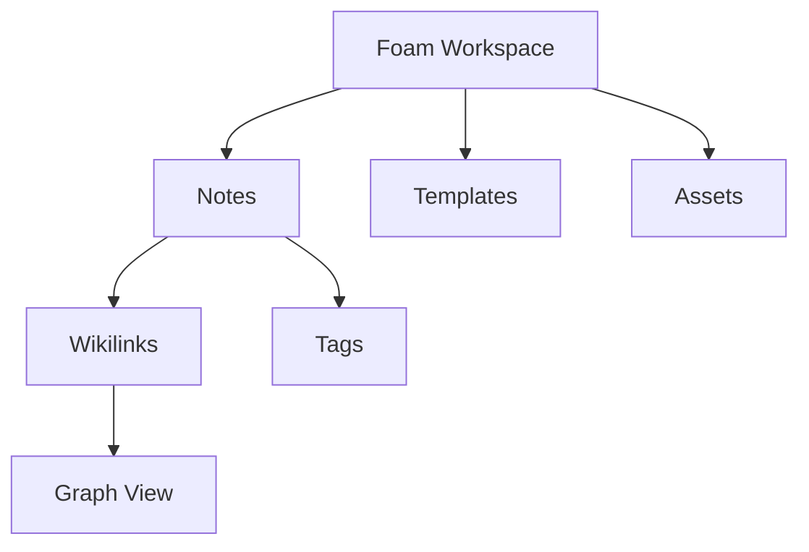

# 使用 VS Code 功能配合 Foam

Foam 基于 Visual Studio Code 强大的编辑能力，将其原生功能无缝融入其中，提供完整的知识管理体验。本指南介绍如何将 VS Code 的内置功能与 Foam 结合使用。

### 键盘快捷键

VS Code 支持各种**键盘快捷键**，其中对我们最重要的是：

| 快捷键        | 操作                          |
| ------------- | ----------------------------- |
| `cmd+N`       | 创建新文件                    |
| `cmd+S`       | 保存当前文件                  |
| `cmd+O`       | 打开文件                      |
| `cmd+P`       | 使用快速选择打开文件          |
| `alt+D`       | 打开今天的每日笔记             |
| `alt+H`       | 打开指定日期的每日笔记         |
| `cmd+shift+P` | 调用命令（见下文）             |

更多信息请参阅 [VS Code 键盘快捷键速查表](https://code.visualstudio.com/docs/getstarted/keybindings#_keyboard-shortcuts-reference)，其中还介绍了如何自定义键绑定。

### 命令

命令让 VS Code 变得非常强大。

要调用命令，请按 `cmd+shift+P`，然后选择要执行的命令。
例如，要查看 Foam 图谱：

- 按 `cmd+shift+P` 打开命令栏
- 开始输入 `show graph`
- 选择 `Foam: Show Graph` 命令

然后就能看到图谱呈现出来。

要查看所有 Foam 命令，请在命令栏中输入 `foam`。
有关命令的更多信息，请参阅 [VS Code 网站上的命令说明](https://code.visualstudio.com/docs/getstarted/userinterface#_command-palette)。

如需进一步了解 VS Code，请查看其[网站](https://code.visualstudio.com/docs#first-steps)。

### 面板

Foam 与 VS Code 面板集成，用于查看单篇笔记和整个知识库的信息。

- **`Foam: links`**：显示所有链接到当前活动笔记或从当前活动笔记链接出去的笔记，帮助你了解连接关系并浏览知识图谱
- **`Foam: Orphaned Notes`**：显示没有入链或出链的笔记，帮助你找出可能需要更好整合的孤立内容
- **`Tag Explorer`**：以层级视图显示工作区中使用的所有标签，更多标签信息请参阅 [[tags]]
- **`Foam: Graph`**：以可视化方式展示笔记之间的连接（也可以使用独立的图谱视图）

### 样式和主题

VS Code 在主题和样式方面提供了丰富的配置选项。运行 `Color Theme` 命令即可找到适合你的设置。
更多信息请参阅 [VS Code 文档](https://code.visualstudio.com/docs/configure/themes)。

### 多光标编辑

同时编辑多个位置，以便高效管理笔记：

**多光标基础操作：**

- `Alt+Click` / `Option+Click` - 在点击位置添加光标
- `Ctrl+Alt+Down` / `Cmd+Option+Down` - 在下方添加光标
- `Ctrl+Alt+Up` / `Cmd+Option+Up` - 在上方添加光标
- `Ctrl+D` / `Cmd+D` - 选择单词的下一个匹配项
- `Ctrl+Shift+L` / `Cmd+Shift+L` - 选择所有匹配项

**批量创建 wikilink：**

1. **选择一个单词**（例如 “Python”）
2. **按 `Ctrl+Shift+L`** 选择所有匹配项
3. **输入 `[[]]`** 将所有实例包裹起来
4. **按方向键** 将光标移到方括号内

### 查找和替换

使用强大的搜索和替换功能维护笔记：

**查找/替换基础操作：**

- `Ctrl+F` / `Cmd+F` - 在当前文件中查找
- `Ctrl+H` / `Cmd+H` - 在当前文件中替换
- `Ctrl+Shift+F` / `Cmd+Shift+F` - 在整个工作区中查找
- `Ctrl+Shift+H` / `Cmd+Shift+H` - 在整个工作区中替换

### 折叠文本

使用可折叠的章节整理长篇笔记：

**折叠控制：**

- **点击折叠图标**，它位于标题旁的编辑器装订线中
- `Ctrl+Shift+[` / `Cmd+Option+[` - 折叠当前章节
- `Ctrl+Shift+]` / `Cmd+Option+]` - 展开当前章节
- `Ctrl+K Ctrl+0` / `Cmd+K Cmd+0` - 全部折叠
- `Ctrl+K Ctrl+J` / `Cmd+K Cmd+J` - 全部展开

## 文件管理

### 资源管理器集成

利用 VS Code 的文件资源管理器整理笔记：

**文件操作：**

- **拖放**文件以重新组织结构
- 使用**右键上下文菜单**快速执行操作
- 使用快捷方式创建**新文件/文件夹**
- 使用 Ctrl+Click / Cmd+Click 进行**批量选择**

**快速文件操作：**

- `F2` - 重命名文件（Foam 会自动更新链接）
- `Delete` - 移到回收站
- `Ctrl+C` / `Cmd+C` 然后 `Ctrl+V` / `Cmd+V` - 复制/粘贴文件
- **右键 → Reveal in Explorer/Finder** - 在文件系统中打开

### 快速打开

快速浏览大型知识库中的文件：

**快速打开命令：**

- `Ctrl+P` / `Cmd+P` - 转到文件
- `Ctrl+Shift+O` / `Cmd+Shift+O` - 转到符号（Markdown 中的标题）
- `Ctrl+T` / `Cmd+T` - 转到工作区中的符号
- `Ctrl+G` / `Cmd+G` - 转到指定行号

**搜索模式：**

```text
# 转到文件（Ctrl+P）
machine       # 查找“machine-learning.md”
proj alpha    # 查找“project-alpha.md”
daily/2025    # 查找 daily/2025 文件夹中的文件

# 转到符号（Ctrl+Shift+O）
@introduction # 跳转到“Introduction”标题
@#setup       # 跳转到“Setup”标题
:50           # 跳转到第 50 行
```

## 搜索和发现

### 全局搜索

在整个知识库中查找内容：

**搜索界面（`Ctrl+Shift+F` / `Cmd+Shift+F`）：**

- **搜索框** - 输入查询内容
- **替换框** - 使用替换箭头切换
- **包含/排除模式** - 按文件类型或文件夹筛选
- **区分大小写** - 区分大小写进行搜索
- **匹配整个单词** - 精确匹配单词
- **使用正则表达式** - 使用高级模式匹配

### 时间线视图

跟踪笔记随时间发生的变化：

**访问时间线：**

1. **打开资源管理器面板**
2. 在底部**展开“Timeline”部分**
3. **选择一个文件**以查看其变更历史
4. **点击时间线条目**以查看差异视图

**时间线功能：**

- **Git 提交**显示笔记的修改时间
- **文件保存**记录编辑会话
- **差异视图**突出显示修改内容
- **还原点**用于恢复以前的版本

### 大纲视图

使用层级结构浏览长篇笔记：

**大纲面板：**

1. **在资源管理器中启用**（展开“Outline”部分）
2. **显示当前笔记的标题层级**
3. **点击标题**跳转到相应章节
4. 在大纲中**折叠/展开**章节

## 版本控制集成

### Git 集成

跟踪知识库的变更：

**源代码管理面板：**

- **查看更改** - 查看已修改的文件
- **暂存更改** - 点击 `+` 暂存文件
- **提交更改** - 输入提交消息并提交
- **同步更改** - 与远程仓库推送/拉取

**笔记的 Git 工作流：**

1. **编写和编辑**笔记
2. 在源代码管理面板中**查看更改**
3. **暂存相关文件**以便提交
4. **编写有意义的提交消息**
5. **提交并推送**以备份或共享

**实用的 Git 功能：**

- **差异视图** - 准确查看修改内容
- **文件历史** - 跟踪笔记随时间的演变
- **分支管理** - 尝试不同的组织方式
- **合并冲突** - 在协作时解决冲突

## Markdown 功能

### 预览集成

在编辑的同时查看格式化后的笔记：

**预览命令：**

- `Ctrl+Shift+V` / `Cmd+Shift+V` - 打开预览
- `Ctrl+K V` / `Cmd+K V` - 在侧边打开预览
- **锁定预览** - 将预览固定到指定文件

**图表（使用 Mermaid 扩展）：**

````markdown

````

## 扩展生态

使用互补扩展扩展 Foam 的功能。
你可以在 [VS Code Marketplace](https://marketplace.visualstudio.com/) 中查找这些扩展。

## 接下来做什么

掌握 VS Code 后，可以继续探索 Foam 的高级主题：

1. **[[recommended-extensions]]** - 查看用于改善笔记体验的互补扩展
2. **[[publish-to-github-pages]]** - 分享你的知识库

[tags]: ../features/tags.md "Tags"
[recommended-extensions]: recommended-extensions.md "Recommended Extensions"
[publish-to-github-pages]: ../publishing/publish-to-github-pages.md "GitHub Pages"
